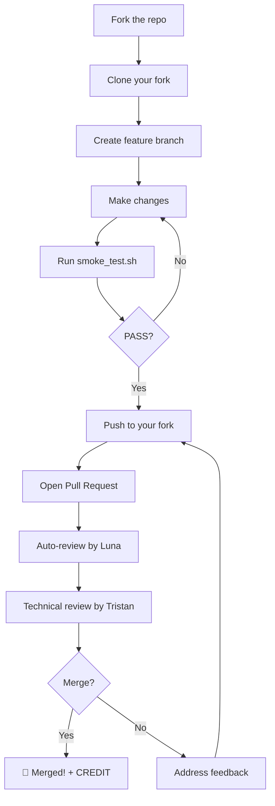

# Contributing to ZWISERFIT AI Store Manager / 贡献指南

> **你不仅在为一个项目贡献代码——你在共建实体健身行业的基础设施。**
> **You are not just contributing code to a project — you are co-building infrastructure for the physical fitness industry.**

---

## 📋 目录

- [行为准则](#行为准则)
- [我能做什么](#我能做什么)
- [Issue 流程](#issue-流程)
- [Pull Request 流程](#pull-request-流程)
- [代码规范](#代码规范)
- [文档贡献](#文档贡献)
- [数据贡献规范](#数据贡献规范)
- [社区沟通](#社区沟通)

---

## 行为准则

本项目遵循 [Contributor Covenant 行为准则](./CODE_OF_CONDUCT.md)。参与即视为同意遵守。简单说：**尊重他人，建设性协作，拒绝 toxicity。**

---

## 我能做什么

| 你的背景 | 推荐切入方式 |
|:---|:---|
| **🧠 零技术背景实体店主** | 提交真实运营场景需求 Issue、测试 Momo 部署、反馈使用体验 |
| **🐍 Python / 后端开发者** | 攻克数据管道（FACE-001、DATA-001）、Agent 能力优化 |
| **🌐 前端 / 全栈开发者** | 门店看板 UI、会员端交互、管理后台 |
| **🔧 嵌入式 / IoT 工程师** | ZWF-20 人脸终端对接、边缘计算、硬件协议逆向（急需！） |
| **📝 文档 / 内容贡献者** | 中英双语文档完善、部署教程、案例撰写 |
| **🔒 安全研究者** | 安全审计、渗透测试、合规审查 |

> 🆘 **当前最急需：嵌入式/IoT工程师** — 详见 [README → We Need](./README.md#-we-need--我们急需)

---

## Issue 流程

### 提交 Bug 报告

1. 搜索 [已有 Issues](https://github.com/ZWISERFIT/zwiserfit-ai-store-manager/issues) 确认未被报告
2. 使用 **Bug 报告模板**（`.github/ISSUE_TEMPLATE/bug_report.md`）
3. 提供：环境信息、复现步骤、期望行为 vs 实际行为、日志/截图

### 提交功能建议

1. 搜索已有 Issues 确认未被提出
2. 使用 **功能请求模板**（`.github/ISSUE_TEMPLATE/feature_request.md`）
3. 说明：要解决的问题、建议方案、替代方案考虑

### Issue 标签体系

| 标签 | 含义 | 适合谁 |
|:---|:---|:---|
| `good first issue` | 入门友好，附完整上下文 | 新贡献者 |
| `help wanted` | 急需外部贡献 | 所有人 |
| `bug` | 已确认的缺陷 | — |
| `enhancement` | 功能改进 | — |
| `data-pipeline` | 数据管道相关 | 后端/IoT |
| `documentation` | 文档相关 | 所有人 |
| `RFC` | 重大变更征求意见 | 核心贡献者 |

---

## Pull Request 流程


### Contribution Workflow

The following diagram illustrates the typical contribution lifecycle from forking the repository to merging a Pull Request.



### 1. 准备工作

```bash
# Fork 本仓库
git clone https://github.com/YOUR_USERNAME/zwiserfit-ai-store-manager.git
cd zwiserfit-ai-store-manager
git checkout -b feat/your-feature-name   # 或 fix/your-bug-fix
```

### 2. 开发规范

- **一个 PR 只做一件事**：功能/修复/文档分开提交
- **commit message 格式**：`<type>: <简短描述>`
  - `feat:` 新功能
  - `fix:` 修复 bug
  - `docs:` 文档更新
  - `chore:` 构建/工具链变更
  - `refactor:` 重构（不改变功能）
  - `test:` 测试相关
- **关联 Issue**：在 PR 描述中写 `Closes #123`

### 3. PR 检查清单

提交前确认：

- [ ] 代码通过本地测试
- [ ] 新增功能有对应测试覆盖
- [ ] 文档已同步更新（如有接口变更）
- [ ] Commit message 符合规范
- [ ] PR 描述清晰：做了什么、为什么、如何测试
- [ ] 如果是数据相关 PR，数据声明了来源层级 `[L1/L2/L3]`

### 4. Code Review 流程

1. 提交 PR 后，至少一位 **核心维护者** 会进行 Review
2. Review 反馈请在一周内回应，否则可能被关闭（可重新打开）
3. 通过 Review 后由维护者合并
4. **大型变更（架构、协议）需先发 RFC Issue 讨论**

---

## 代码规范

### Python（PEP 8）

ZWISERFIT 后端与 Agent 代码遵循 **PEP 8** 规范：

```python
# ✅ 正确示例
def calculate_member_retention(member_data: list[dict]) -> float:
    """计算会员留存率。

    Args:
        member_data: 会员活跃记录列表

    Returns:
        留存率（0.0 - 1.0）
    """
    if not member_data:
        return 0.0
    active = sum(1 for m in member_data if m.get("is_active"))
    return active / len(member_data)
```

**要点：**
- 4 空格缩进（禁止 Tab）
- 行宽 ≤ 100 字符
- 函数/类必须有 docstring（Google 风格）
- 类型注解（Type Hints）强制要求
- 使用 `black` 自动格式化，`ruff` 做 lint 检查
- 命名：`snake_case` 变量/函数，`PascalCase` 类，`UPPER_CASE` 常量

### Node.js / JavaScript（ESLint）

前端与工具链代码遵循 **ESLint** 推荐规范：

```javascript
// ✅ 正确示例
const calculateMemberRetention = (memberData) => {
  if (!memberData?.length) return 0;
  const active = memberData.filter((m) => m.isActive).length;
  return active / memberData.length;
};
```

**要点：**
- 2 空格缩进
- 分号强制
- 单引号字符串
- 优先 `const`，需要重新赋值用 `let`，禁止 `var`
- 使用 Prettier 自动格式化
- JSDoc 注释用于公共 API

### 通用规范

- **注释语言**：中文优先，技术术语保留英文
- **命名语言**：英文（变量名、函数名、文件名）
- **编码**：UTF-8
- **换行符**：LF（`\n`）
- **文件末尾**：保留一个空行

---

## 文档贡献

文档质量是 ZWISERFIT 的一等公民（Constitution Principle 5.2）。

### 文档类型

| 文档 | 路径 | 读者 |
|:---|:---|:---|
| README.md | 根目录 | 所有人（项目门户） |
| CONSTITUTION.md | 根目录 | 贡献者（宪法级规范） |
| BRAND.md | 根目录 | 潜在用户/投资人（品牌叙事） |
| CONTRIBUTING.md | 根目录 | 贡献者（本文档） |
| docs/ | 子目录 | 开发者/部署者 |
| deploy/ | 子目录 | 部署运维人员 |

### 文档写作规范

- **中英双语**：关键内容提供英文对照，方便国际贡献者
- **Markdown 格式**：使用标准 CommonMark
- **链接检查**：确保所有相对链接有效
- **代码示例**：可复制运行，标注语言
- **首次提及**：技术术语首次出现时标注英文

---

## 数据贡献规范

遵循 [Constitution Article I: Data Sovereignty Supreme](./CONSTITUTION.md)。

### 数据来源层级声明

任何数据提交 **必须** 声明数据来源层级：

| 层级 | 标签 | 含义 | 示例 |
|:---|:---|:---|:---|
| **L1** | `[L1 - Measured]` | 真实门店实时采集 | 人脸考勤打卡记录 |
| **L2** | `[L2 - Test-derived]` | 测试环境模拟数据 | 118条测试记录 |
| **L3** | `[L3 - Historical Reference]` | 历史归档参考数据 | 2024年月度报表 |

### 禁止行为

- ❌ 编造数据（Data Fabrication）
- ❌ 混合真实与虚构数据生成汇总报告（Brain Supplement Rule）
- ❌ 未标注来源层级的数据提交

> 违反数据诚信原则 = 违反宪法第一条 = 立即回滚并公示

---

## 社区沟通

- **技术讨论**：[GitHub Issues](https://github.com/ZWISERFIT/zwiserfit-ai-store-manager/issues)
- **生态合作**：founder@zwiserfit.com（标题注明 `[ZWISERFIT合作]`）
- **RFC 提案**：开 Issue 并打 `RFC` 标签，至少 7 天讨论期

### 沟通礼仪

- 保持专业与尊重
- 问题描述具体（版本号、环境、复现步骤）
- 耐心等待回复（核心维护者可能在不同时区）
- **没有愚蠢的问题**——敢问就是贡献

---

> **ZWISERFIT 不是"我的项目"——它是实体健身行业的基础设施。**
> **你每一次 Issue、每一个 PR，都在塑造未来千万门店的运营标准。**
> 感谢你的参与 ⚙️
